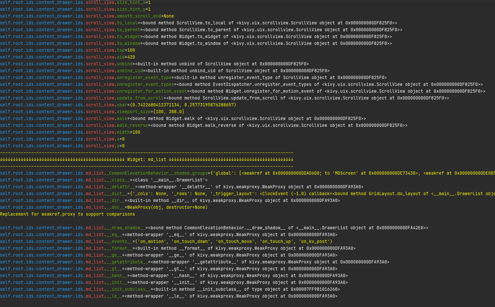

# kivy_widget_attribute_printer
Prints all attributes of all Kivy/KivyMD widgets with ID so that you don't need to read the documentation all the time.


Add this code to your **main.py** file
```
from print_all_kivy_attributes import print_all_widget_attributes #import this function

    def build(self):
        Clock.schedule_once(self.print_all_attributes) #add this line to the build function

    def print_all_attributes(self, *args): #add this function in your class
        print_all_widget_attributes(self.root.ids)
```

Terminal output when your app starts:

