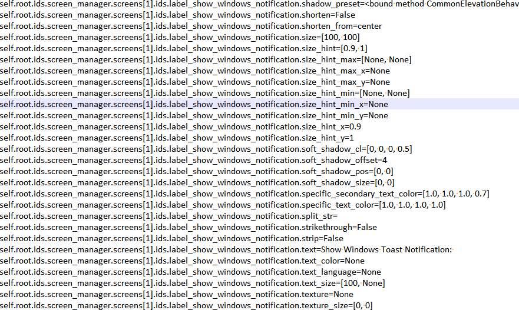

# kivy_widget_attribute_printer
Prints all attributes of all Kivy/KivyMD widgets with ID so that you don't need to read the documentation all the time.


Add this code to your **main.py** file
```
from print_all_kivy_attributes import print_all_widget_attributes #import this function

    def build(self):
        Clock.schedule_once(self.print_all_attributes) #add this line to the build function

    def print_all_attributes(self, *args): #add this function to the class of your app
        print_all_widget_attributes(self.root.ids) #-> add this line if you online want to have the console output
        print_all_widget_attributes(self.root.ids, write_to_file='show_all_items.txt')  #-> add this line if you want to write all attributes to a txt file.
```

Terminal output when your app starts:


Screenshot of the txt file:

